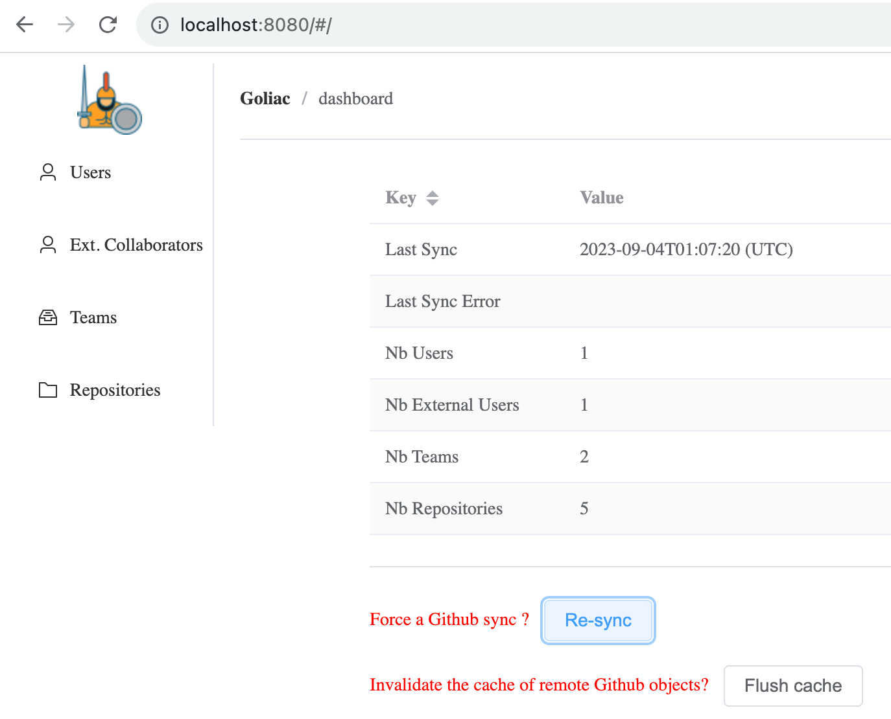

#  Goliac

Goliac (Github Organization Leveraged by Infrastructure As Code), is a collaborative tool to manage your Github Organization (users/teams/repositories) via
- yaml manifests files structured in a Github repository
- this IAC Github repositories can be updated by teams from your organization, but only the repositories they owns
- all repositories rules are enforced via a central configuration that only the IT/security team can update (if you are using Github Enterprise)
- a Github App watching this repository and applying any changes


## For Github admin

- [why Goliac](docs/why_goliac.md)
- [Installation guide](docs/installation.md)
- [Security hardening](docs/security.md)
- [How to sync (users) from external](docs/installation.md#syncing-users-from-an-external-source)
- [Troubleshooting guide](docs/troubleshooting.md)

## For regular users

As a regular user, you want to be able to
- create new team
- edit team's definition
- manage your team's repositories

### Create a new team

If you want to create a new team (like `foobar`), you need to create a PR with a `/teams/foobar/team.yaml` file:

```
apiVersion: v1
kind: Team
name: foobar
spec:
  owners:
    - user1
    - user2
  members:
    - user3
    - user4
```

The users defined there are in 2 different categories
- members: are part of the team (and will be writer on all repositories of the team)
- owners: are part of the team (and will be writer on all repositories of the team) AMD can approve PR in the `foobar` teams repository (when you want to change a team definition, or when you want to create/update a repository definition)

The users name used are the one defined in the `/users` sub directories (like `alice`)

### Create a repository

On a given team subdirectory you can create a repository definition via a yaml file (like `/teams/foobar/awesome-repository.yaml`):

```
apiVersion: v1
kind: Repository
name: awesome-repository
```

This will create a `awesome-repository` repository under your organization, that will be
- private by default
- writable by all owners/members of this team (in our example `foobar`)

You can of course tweak that:

```
apiVersion: v1
kind: Repository
name: awesome-repository
spec:
  public: true
  allow_auto_merge: true
  delete_branch_on_merge: true
  allow_update_branch: true
  writers:
  - anotherteamA
  - anotherteamB
  readers:
  - anotherteamC
  - anotherteamD
```

In this last example:
- the repository is now public
- the repository allows auto merge
- the repository will delete the branch on merge
- the repository allows to update the branch
- other teams have write (`anotherteamA`, `anotherteamB`) or read (`anotherteamC`, `anotherteamD`) access

### Archive a repository

You can archive a repository, by a PR that move the yaml repository file into the `/archived` directory

## REST API and UI

Goliac comes with a [REST API](docs/api_docs/bundle.yaml) if you need to search through the `teams` repository via APIs, and comes with a UI to explore, and interacts with Goliac


