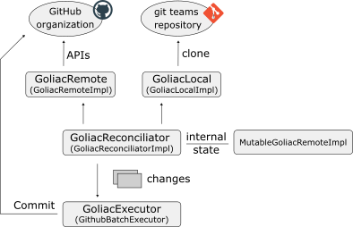

# Architecture

Goliac architecture is mainly sitted in the `internal/goliac.go` file (see `GoliacImpl.applyToGithub()`):

- sync users from Github (if we are in the Entreprise version) ("prelude")
- reconciliate ("main)"
- update CODEOWNERS and few files (in the goliac "teams" repository) ("post")

## Reconciliation

The idea is

- fetch the GitOps representation (and represent them as "Entities")
- fetch the current Github org state (via Github APIs)
- see the changes to apply to reconciliate (`GoliacReconciliatorImpl.Reconciliate()`)
- execute the changes (`GithubBatchExecutor.Commit()`), if the number of changes are not too numerous (else it is fishy)

