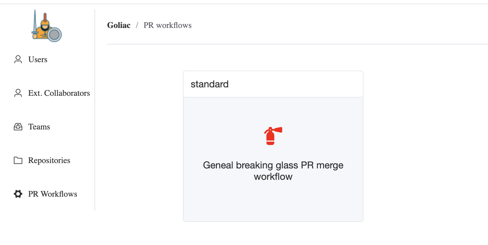

# Breaking Glass workflow



You have the possibliity to enable a Breaking Glass workflow that allows to force merge PRs in specific repositories and for specific teams. This is useful when you need to merge a PR in an emergency situation.

## Register the Github App

To be able to enable the Breaking Glass workflow, you need to register the Github Appwith OAuth permissions. To do so

- go to the Github App settings (like https://github.com/organizations/AlayaCare/settings/apps/alayacare-goliac)
- you need to create a client secret (if you don't have one already)
- in General, under Identifying and authorizing users
    - set the Callback URL to `http://<Goliac http endpoint>/api/v1/auth/callback`
- and you need to set the following (new) environment variables: `GOLIAC_GITHUB_APP_CLIENT_SECRET` 

## Enable the Breaking Glass workflow

To enable the Breaking Glass workflow, you need to
- create (or several) `/forcemerge_workflows/_afile_.yaml`:

```yaml
apiVersion: v1
kind: ForcemergeWorkflow
name: _afile_
spec:
  description: General breaking glass PR merge workflow
  repositories:
    allowed:
      - .* # you can use ~ALL
    # except:
    #   - .*-private
  acls:
    allowed:
      - team4
    #   - otherteam.*
    #   - ~ALL
    # except:
    #   - team1
  steps: # optional step to execute before force merging the PR
    - name: jira
      properties:
        project_key: SRE
        issue_type: Bug
```

- update the `/goliac.yaml` file to include the new workflow:

```yaml
...
forcemerge_workflows:
- _afile_
```

## Use the Jira step

The Jira step is optional and can be used to create a Jira issue before force merging the PR. The step is defined as follows:

```yaml
steps:
  - name: jira
    properties:
      project_key: SRE
      issue_type: Bug
```

You will need to set the following environment variables:
- `GOLIAC_PR_FORCEMERGE_JIRA_ATLASSIAN_DOMAIN` like `mycompany.atlassian.net` or `https://mycompany.atlassian.net`
- `GOLIAC_PR_FORCEMERGE_JIRA_EMAIL` of the service account
- `GOLIAC_PR_FORCEMERGE_JIRA_API_TOKEN` of the service account
