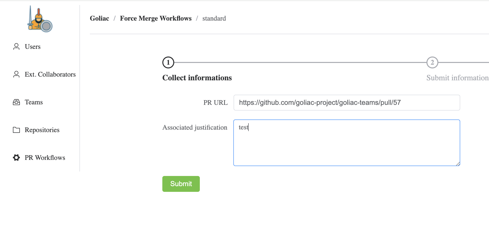
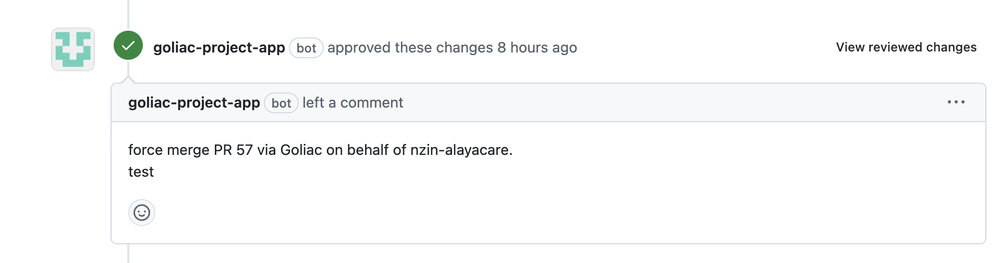

# Breaking Glass workflow

If you enable the Breaking Glass workflow, you will be able to force merge PRs in specific repositories and for specific teams. This is useful when you need to merge a PR in an emergency situation.

## First way: use the wizard




You have the possibliity to enable a Breaking Glass workflow that allows to force merge PRs in specific repositories and for specific teams. This is useful when you need to merge a PR in an emergency situation.




See [Workflows](resource_workflow) to see how to enable it

## Second way: use PR comments

You can also use PR comments to force merge a PR.

```
/forcemerge:<workflow_name>: <explanation>
```

Example:

```
/forcemerge:standard: need to merge this PR out of regular office hours to fix the production issue
```

This will trigger the `standard` workflow to merge the PR.

## Squash merge

By default, the PR will be merged with the `commit` merge type.


If you want to squash merge the PR, you can add the `/squash` string in the explanation.

Example:

```
/forcemerge:standard: need to merge this PR out of regular office hours to fix the production issue /squash
```

This will trigger the `standard` workflow to merge the PR with the `squash` merge type.
