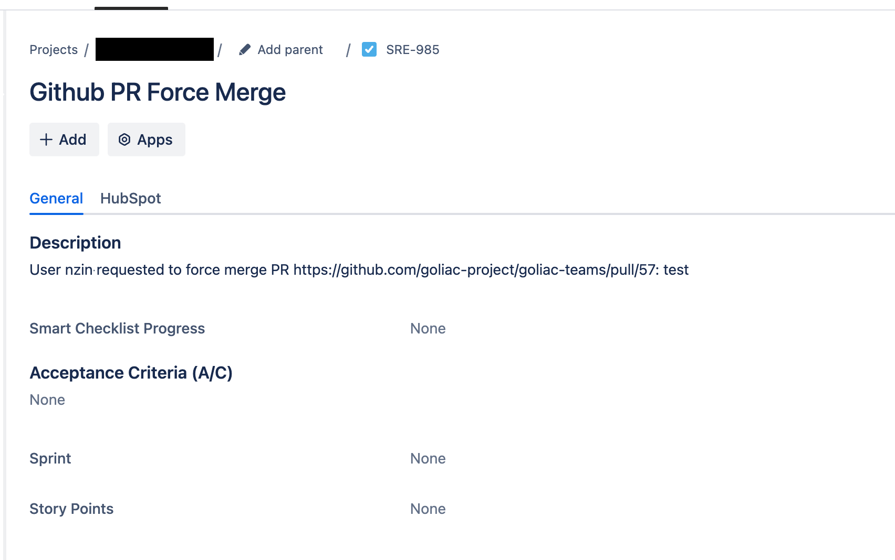

# Workflow

Workflow are some action you can through Goliac UI. There are currently:
- noop (to test)
- forcemerge (to bypass pullrequest review)

A workflow can have few different steps, especially create a slack message, create a jira ticket...

To create a workflow you need to
- define a workflow in `/workflows` directory
- enable it in `/goliac.yaml`


## Register the Github App

To be able to enable the workflows, you need to register the Github Appwith OAuth permissions. To do so

- go to the Github App settings (like https://github.com/organizations/AlayaCare/settings/apps/alayacare-goliac)
- you need to create a client secret (if you don't have one already)
- in General, under Identifying and authorizing users
    - set the Callback URL to `https://<Goliac DNS endpoint>/api/v1/auth/callback`
- and you need to set the following (new) environment variables:
  - `GOLIAC_GITHUB_APP_CLIENT_SECRET` (the secret associated with the webhook)
  - `GOLIAC_GITHUB_APP_CALLBACK_URL` (the `Callback URL` of your Github App)

Note: to create an Atlassian API token, follow [the instructions here](https://support.atlassian.com/atlassian-account/docs/manage-api-tokens-for-your-atlassian-account/).

## Create a PullRequest Review (breaking glass) workflow

To enable the Breaking Glass workflow, you need to
- create (or several) `/workflows/_afile_.yaml`:

```yaml
apiVersion: v1
kind: Workflow
name: _afile_
spec:
  description: General breaking glass PR merge workflow
  workflow_type: forcemerge
  repositories:
    allowed:
      - .* # you can use ~ALL
    # except:
    #   - .*-private
  acls:
    allowed:
      - team4
    #   - otherteam.*
    #   - ~ALL
    # except:
    #   - team1
  steps: # optional step to execute before force merging the PR
    - name: jira_ticket_creation
      properties:
        project_key: SRE
        issue_type: Bug
    - name: slack_notification
      properties:
        channel: sre
```


- update the `/goliac.yaml` file to include the new workflow:

```yaml
...
workflows:
- _afile_
```


## Create a noop workflow

If you want to test a workflow before enabling it for everyone, you can create
a No Operation workflow, same as `forcemerge` but the workflow_type as to be `noop`:

```yaml
apiVersion: v1
kind: Workflow
name: _afile_
spec:
  description: Testing workflow
  workflow_type: noop
  repositories:
    allowed:
      - .* # you can use ~ALL
    # except:
    #   - .*-private
  acls:
    allowed:
      - team4
    #   - otherteam.*
    #   - ~ALL
    # except:
    #   - team1
  steps: # optional step to execute before force merging the PR
    - name: jira_ticket_creation
      properties:
        project_key: SRE
        issue_type: Bug
    - name: slack_notification
      properties:
        channel: sre
```

- update the `/goliac.yaml` file to include the new workflow:

```yaml
...
workflows:
- _afile_
```


## The ACL section

The ACL are here to let you know for this workflow
- who can see / action it
- on which repositories


## Use the Jira step



The Jira step is optional and can be used to create a Jira issue before force merging the PR. The step is defined as follows:

```yaml
steps:
  - name: jira_ticket_creation
    properties:
      project_key: SRE
      issue_type: Bug
```

You will need to set the following environment variables:
- `GOLIAC_WORKFLOW_JIRA_ATLASSIAN_DOMAIN` like `mycompany.atlassian.net` or `https://mycompany.atlassian.net`
- `GOLIAC_WORKFLOW_JIRA_EMAIL` of the service account
- `GOLIAC_WORKFLOW_JIRA_API_TOKEN` of the service account


## Use the Slack step

The Slack step is optional and can be used to send a notification to a Slack channel before force merging the PR. The step is defined as follows:

```yaml
steps:
  - name: slack_notification
    properties:
      channel: sre
```

You will need to set the following environment variables:
- `GOLIAC_SLACK_TOKEN` the Slack token
- `GOLIAC_SLACK_CHANNEL` the Slack channel

Dont forget to invite the Slack bot to the channel.


