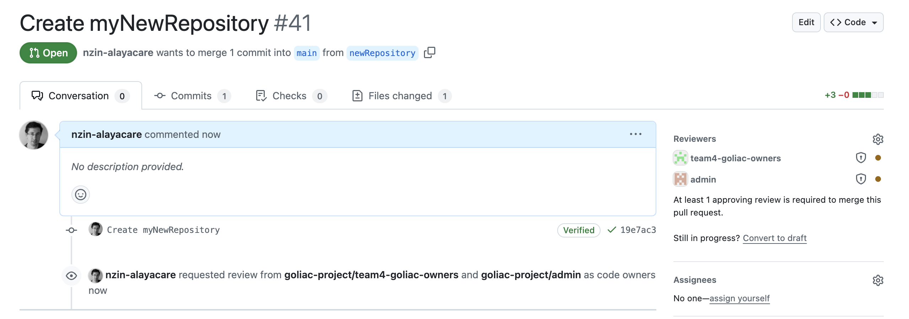

# What is Goliac

Goliac is a tool to manage your Github organization in a GitOps way, a bit like [ArgoCD](https://argoproj.github.io/argo-cd/), (or [Terraform](https://www.terraform.io/) ) but for Github organization.

It allows you to
- define your Github organization structure (teams, users, repositories) into a git repository, and to apply this structure to your Github organization.
- enforce security rules (like [Github Rulesets](https://docs.github.com/en/repositories/configuring-branches-and-merges-in-your-repository/managing-rulesets/about-rulesets)) across your Github organization
- allow your developers to manage their team and their repositories (and only them) autonomously

You will get the most of Goliac if you are on an Enterprise plan, or on prem (especially to be able to use [Github Ruleset](https://docs.github.com/en/repositories/configuring-branches-and-merges-in-your-repository/managing-rulesets/about-rulesets)), and it runs well for organization with ~ 1000-2000 repos, ~ 500-1000 users, ~ 300-500 teams or below. It should works well above these numbers, but you may need to adapt the way you use it (because it may need to do a lot of API calls to Github).

Goliac is a free opensource project, that you can install on your own infrastructure, and that is designed to be run easily into a kubernetes environment.

## Why Goliac

Goliac can improve your Github organization management in several ways:
- security
- developer friendly
- cost

## How it works


Goliac use a [GitOps](https://www.redhat.com/en/topics/devops/what-is-gitops) approach:
- you define into one Github repository (usually called `goliac-teams`), through yaml files, organized into a file hierarchy, the state you want your Github organization to be. You define
  - your security rules
  - your users (or you import/link them from another external source)
  - your teams
  - the repositories owned by each teams
- when Goliac runs, it will apply these state to your Github organization (and enforce it)
- each change you want to bring is done via a Github Pull Request, that needs to be reviewed and validated, and can be auditing via the Git commit history
- each team can change part of the `goliac-teams` structure they own (a sub directory)

### Opinionated but flexible

Goliac is opinionated in the way it works, but it is also flexible:
- you import your users (manually or via an external source, like Github SAML integration)
- you group them into teams (see below)
- you define repository and give them a team owner (and only one)
- other team can be "invited" to have read or read-write access to repos (owned by a specific team)


On the disk it translate to a hierarchy of yaml files like:

```
goliac-teams
├── teams
│   ├── teamA
│   │   ├── team.yaml <- the definition of team1
│   │   ├── repo1.yaml
│   │   └── repo2.yaml
│   └── teamB
│       ├── team.yaml <- the definition of team2
│       └── repo3.yaml
```

where a `team.yaml` looks like

```yaml
apiVersion: v1
kind: Team
name: teamA
spec:
  owners:
    - user1@alayacare.com
    - user2@alayacare.com
 ```

 and a `repo.yaml` looks like
 
```yaml
apiVersion: v1
kind: Repository
name: repo1
```

### Giving access to a repository

You can give access to a repository to a team by editing a repository yaml file.


For example to give read access to `teamA` to `repo3`, you can edit `repo3.yaml` like:

```yaml
apiVersion: v1
kind: Repository
name: repo3
spec:
  readers:
    - teamA
```

The nice thing is that:
1. you can do it editing and submitting this change via a Pull Request (GitOps)
2. IT do not need to be in the loop, *team B* can approve itself the PR (with the magic of CODEOWNERS file)


### Creating new repositories

You can create a new repository by creating a new yaml file into your team directory, via a Pull Request, and ask a colleague for a review.



Note: the colleague must be in the team that owns the repository, and in the `owners` section of the team. Usually owners are PM, or tech leads.


### Enforcing security rules

Goliac allows you to enforce security rules across your Github organization, via [Github Rulesets](https://docs.github.com/en/repositories/configuring-branches-and-merges-in-your-repository/managing-rulesets/about-rulesets). You can define global rules that will be applied to all repositories, or to a subset of repositories.

To do so, you can add rulesets into the main `goliac.yaml` file, and add some files into the `rulesets` directory:

```
goliac-teams
├── goliac.yaml
├── rulesets
│   └── default.yaml
├── teams
│   ├── teamA
│   │   ├── team.yaml <- the definition of team1
│   │   ├── repo1.yaml
│   │   └── repo2.yaml
│   └── teamB
│       ├── team.yaml <- the definition of team2
│       └── repo3.yaml
```

## Security friendly

Goliac allows your company to pass security compliance audit by:
- defining global rules (based on [Github Rulesets](https://docs.github.com/en/repositories/configuring-branches-and-merges-in-your-repository/managing-rulesets/about-rulesets) if you are on Github Enterprise plan)
- allowing users to manage their team and the repositories they own (and only them)
- bringing auditing of who has done what in 2 places:
  - via a git history of the `goliac-teams` repository
  - via logs of Goliac service (but you need to have a good log management system in place)
- via a [GitOps](https://www.redhat.com/en/topics/devops/what-is-gitops) approach: i.e. via a clear directory structure stored into a git repository

## Developer friendly

Once a team of developers has been created, the team can
- manage their resources (i.e. their team's member and their repositories defintion) autonomously (and so without having to rely on your IT departement each time a team needs a change)
- via **simple** yaml files. You dont need to learn a new specific definition langage.
- but restricted by global policies defined previously by the security team. For example you can specifiy a organization-wide policy asking for peer-review across all Github repositories, before any Pull Request being merged. Or you can ask a specific CI test to pass for all Github repositories, or a specific subset of Github repositoties

## Cost

Goliac is a free opensource project. You can install it on your own infrastructure, and it is designed to be run easily into a kubernetes environment.

A comparable solution is to use Terraform (and a git repository) to achieve almost the same result, except that
- if you are using Terraform Cloud, you will have to pay for each resource you manage
- with terraform, you still need to centrally managed all operations via your IT team, which can be a bottleneck, and also less flexible


## Why not using other tools?

There are several existing tools that can help you define automatically your Github organization

### Why not using terraform/another tool

You can use Terraform (and a git repository) to achieve almost the same result, except that with terraform, you still need to centrally managed all operations via your IT team.

Goliac allows you to provide a self-served tool to all your employees

### Why not using Github integrations

Github itself allows you different integrations (see `https://github.com/ORG/goliac-project/settings/security`), in particular 
- SSO users integration (SAML)
- and teams integration (Azure Active Directory and Okta)

If Github integration fits your needs, go for it. But if you want some flexibility (creating teams independently than the company organization, not having to rely on the IT departement each time you want to create a repository), Goliac may be more flexible to use.

## Requirements

To use the full capabilities of Goliac, through the Github Rulesets features you need
- either to be on Github cloud on the Enteprise plan
- or use GHES (Github Enterprise Server) 3.11

## Cost and installation

- Goliac is a free opensource project.
- currently Goliac manages 1 Github organization per instance
- The installation is relatively easy:
  - either you install a standalone application (Goliac app comes as a single binary)
  - or you deploy Goliac docker image (via docker-compose or in kubernetes). You can build yourself the docker image or use pre-built images (https://github.com/goliac-project/goliac/pkgs/container/goliac).
  - you need to create a definition of what Goliac manages: aka the goliac "teams" repository. With it you can define and managed either partially or totally your Github organization
- the definition (and the maintenance) of your Github organization is done via simple yaml file, and dont requires special skills or langage know-how
